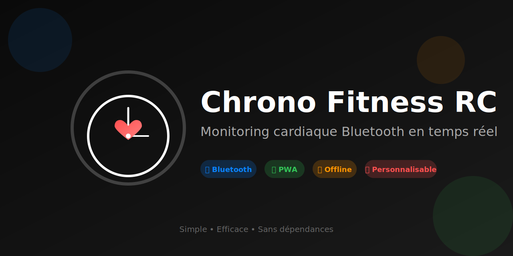

<p align="center">
  
</p>

# 💓⏱️ Chrono Fitness RC

> Chronomètre fitness minimaliste avec monitoring cardiaque Bluetooth en temps réel

[](https://parksto.github.io/fitness-chrono/chrono-fitness-hr.html)
[](https://parksto.github.io/fitness-chrono/chrono-fitness-hr.html)
[](https://parksto.github.io/fitness-chrono/chrono-fitness-hr.html)

## ✨ Fonctionnalités

- 🔵 **Connexion Bluetooth** - Compatible avec les capteurs cardiaques standard (Heart Rate Service)
- 🎨 **Zones cardiaques colorées** - Visualisation en temps réel avec transitions progressives
- ⚙️ **Personnalisation complète** - Ajuste les zones et couleurs selon tes besoins
- 📱 **Application installable** - Ajoute-la sur ton écran d'accueil comme une app native
- 🌐 **Mode offline** - Fonctionne sans connexion après la première visite
- 🎯 **Interface minimaliste** - Focus sur l'essentiel : ton rythme cardiaque et le temps

## 📱 Démo

https://github.com/user-attachments/assets/7dbd30b7-606c-4011-9c13-afd942ddf6b3

*Application en action : connexion Bluetooth, affichage temps réel de la fréquence cardiaque avec zones colorées et animation de fond pulsante*

## 🚀 Essayer maintenant

**👉 [Lancer l'application](https://parksto.github.io/fitness-chrono/chrono-fitness-hr.html)**

Compatible avec tous les navigateurs modernes (Chrome, Edge, Vivaldi, Safari)

## 📱 Installation

### Sur Android (Chrome / Edge / Vivaldi)

1. Ouvre [l'application](https://parksto.github.io/fitness-chrono/chrono-fitness-hr.html)
2. Menu ⋮ > **"Ajouter à l'écran d'accueil"**
3. L'icône apparaît sur ton écran d'accueil !

### Sur iOS (Safari)

1. Ouvre [l'application](https://parksto.github.io/fitness-chrono/chrono-fitness-hr.html) dans Safari
2. Bouton Partage 📤 > **"Sur l'écran d'accueil"**
3. Valide l'ajout

## 🔧 Utilisation

### Premier démarrage

1. **Connecte ta montre** : Ouvre le menu ☰ et clique sur "Connecter montre"
2. **Sélectionne ton appareil** dans la liste Bluetooth
3. **C'est parti !** Ton rythme cardiaque s'affiche en grand

### Pendant l'entraînement

- **Tap sur l'écran** pour réinitialiser le chronomètre
- **Mode paysage** active automatiquement le plein écran
- Les **couleurs changent progressivement** selon ta zone d'effort

### Personnalisation

Menu ☰ > Zones de fréquence cardiaque
- Ajuste les seuils de chaque zone (en BPM)
- Choisis tes propres couleurs
- Tes réglages sont sauvegardés automatiquement

## 📊 Zones cardiaques

### Comment définir tes zones ?

**1. Calcule ta fréquence cardiaque maximale (FCmax)**

Formule de Tanaka (plus précise) :
```
FCmax = 208 - (0,7 × ton âge)
```

Exemple : 45 ans → FCmax = 208 - (0,7 × 45) = **176 bpm**

**2. Applique les pourcentages par zone**

| Zone | % FCmax | Objectif |
|------|---------|----------|
| ⚪ Repos | < 50% | Récupération |
| 🔵 Échauffement | 50-60% | Activation progressive |
| 🟢 Brûlage graisses | 60-70% | Endurance, perte de poids |
| 🟡 Aérobie | 70-80% | Amélioration cardio |
| 🟠 Anaérobie | 80-90% | Performance |
| 🔴 Extrême | 90-95% | Effort maximal |
| 🔴 Danger | > 95% | À éviter |

**3. Exemple de calcul (45 ans, FCmax = 176 bpm)**

- Repos : < 88 bpm
- Échauffement : 88-106 bpm
- Brûlage graisses : 106-123 bpm
- Aérobie : 123-141 bpm
- Anaérobie : 141-158 bpm
- Extrême : 158-167 bpm
- Danger : > 167 bpm

**4. Personnalise dans l'app**

Menu ☰ > Zones de fréquence cardiaque : ajuste chaque seuil selon tes calculs !

> 💡 **Astuce** : Si tu connais ta FCmax réelle (mesurée lors d'un test d'effort), utilise-la plutôt que la formule. Pour les sportifs entraînés, la formule de Karvonen (qui prend en compte la FC de repos) est encore plus précise.

## 🔍 Compatibilité

### Navigateurs
- ✅ Chrome / Edge (Android & Desktop)
- ✅ Vivaldi (Android & Desktop)
- ✅ Safari (iOS)
- ⚠️ Firefox (Bluetooth limité)

### Appareils Bluetooth
Compatible avec tout capteur cardiaque utilisant le **Heart Rate Service** standard :
- Montres connectées (Huawei, Garmin, Polar, etc.)
- Ceintures cardiaques
- Brassards optiques

## 🐛 Résolution de problèmes

**Le Bluetooth ne fonctionne pas**
- Vérifie que tu es bien en HTTPS (le lien GitHub Pages l'est)
- Active le Bluetooth sur ton appareil
- Autorise l'accès Bluetooth dans ton navigateur
- Sur iOS, utilise Safari (pas Chrome)

**L'app ne s'installe pas**
- Vide le cache de ton navigateur
- Essaie depuis le menu du navigateur plutôt que l'icône système
- Sur iOS, assure-toi d'utiliser Safari

**Les données ne se sauvegardent pas**
- Vérifie que tu n'es pas en navigation privée
- Autorise les cookies et le stockage local

## 💡 Astuces

- **Raccourcis clavier** : 
  - `R` pour reset le chrono
  - `M` pour ouvrir le menu
- **Mode paysage** : Plus confortable pour suivre ton RC pendant l'effort
- **Déconnexion automatique** : La montre se reconnecte automatiquement si tu rouvres l'app

## 🛠️ Technologies

Cette application est une Progressive Web App (PWA) utilisant :
- Web Bluetooth API pour la connexion sans fil
- Service Workers pour le mode offline
- LocalStorage pour la persistence des réglages
- Pure HTML/CSS/JS (aucune dépendance)

## 📄 Licence

Projet open source - Utilise-le, modifie-le, partage-le librement !

## 🤝 Contribution

Des idées d'amélioration ? Des bugs à signaler ? N'hésite pas à ouvrir une issue ou proposer une pull request !

---

**Développé avec ❤️ pour les passionnés de fitness**

*Bon entraînement ! 💪*
